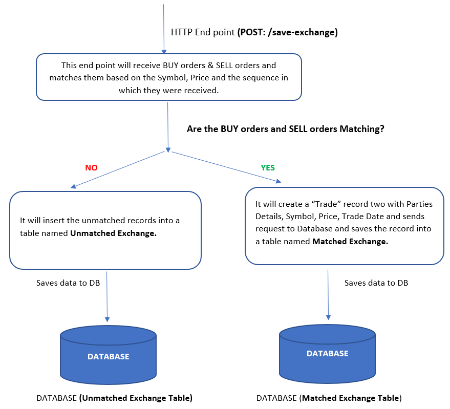
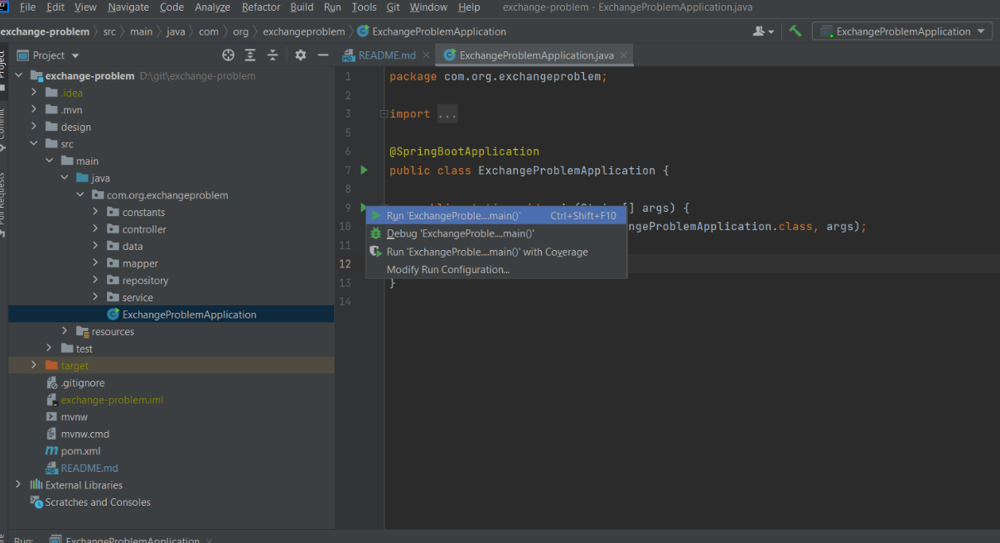
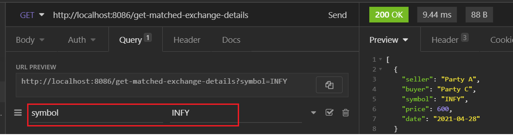
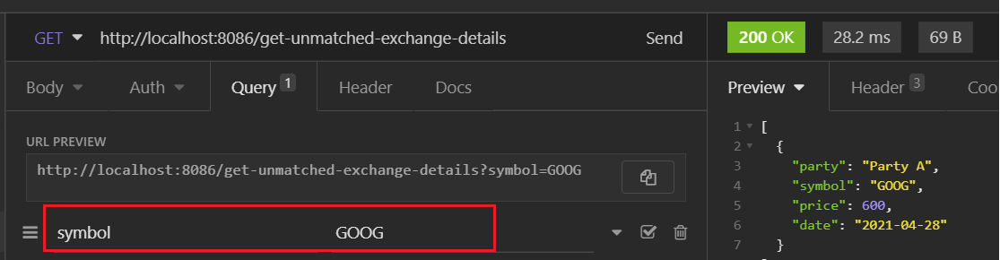

# Exchange Problem

## My Understanding of the Problem Statement

According to the problem statement, I have implemented 2 REST End Points
using Spring Boot. The REST API's are as below:

#### 1. GET Request: 
To get the List of trades with the ability to filter based on Parties, SYMBOL or Date.

#### 2. GET Request: 
To List the orders that are not yet matched, with the ability to filter based on SYMBOL, Price.

## High Level Design

Below is the design that I have created for receiving the data, performing
the matching and saving the trade details into the DB. I am yet to
create this end point /save-exchange. I will submit this API within 2 days.
**Currently I have used MOCK DATA to insert exchange details directly into the tables**.

Please find the design below.



## Steps to run the Project

#### Step 1:

Clone this repository to local.

#### Step 2:

Please Have any of the database configured in the system. I used Postgres DB
and Dbeaver as DB client.

#### Step 3:

Run the below query to create a schema named exchange
```
CREATE SCHEMA exchange AUTHORIZATION postgres;
```

#### Step 4:

Run the below query to create a table named matched_exchange inside the
schema exchange.
```
CREATE TABLE exchange.matched_exchange (
	id uuid NOT NULL,
	seller varchar NOT NULL,
	buyer varchar NOT NULL,
	symbol varchar NOT NULL,
	price numeric NOT NULL,
	"date" date NOT NULL,
	created_date timestamptz(0) NOT NULL
);
```

#### Step 5:

Run the below query to create a table named unmatched_exchange inside the
schema exchange.
```
CREATE TABLE exchange.unmatched_exchange (
	id uuid NOT NULL,
	party varchar NOT NULL,
	symbol varchar NOT NULL,
	price numeric NOT NULL,
	created_date timestamptz(0) NOT NULL,
	relation varchar NOT NULL
);
```

#### Step 6:

Run the below query to insert data into the matched_exchange table.
```
INSERT INTO exchange.matched_exchange
(id, seller, buyer, symbol, price, "date", created_date)
VALUES('095159db-1865-47dd-8b7f-076ff29674f2'::uuid, 'Party C', 'Party B', 'ORCL', 800, '2021-01-12', now());

INSERT INTO exchange.matched_exchange
(id, seller, buyer, symbol, price, "date", created_date)
VALUES('095159db-1875-43dd-8b7f-076ff29674f2'::uuid, 'Party A', 'Party B', 'IBM', 110, '2021-03-17', now());

INSERT INTO exchange.matched_exchange
(id, seller, buyer, symbol, price, "date", created_date)
VALUES('094959db-1995-43dd-8b7f-076ff29674f1'::uuid, 'Party A', 'Party C', 'INFY', 600, '2021-04-01', now());
```

#### Step 7:

Run the below query to insert data into the unmatched_exchange table.
```
INSERT INTO exchange.unmatched_exchange
(id, party, symbol, price, created_date, relation)
VALUES('6cff1285-9d34-8547-ae17-b1c35b95e4a2'::uuid, 'Party A', 'GOOG', 600, now(), 'SELL');

INSERT INTO exchange.unmatched_exchange
(id, party, symbol, price, created_date, relation)
VALUES('6cff1285-9d34-9571-ae17-b1c35b95e4a2'::uuid, 'Party C', 'IBM', 110, now(), 'BUY');

INSERT INTO exchange.unmatched_exchange
(id, party, symbol, price, created_date, relation)
VALUES('6cff1285-9d34-7819-ae17-b1c35b95e4a1'::uuid, 'Party D', 'SYN', 400, now(), 'BUY');
```

#### Step 8:

After the DB setup is done. Our tables are ready for quering. Now we need to start the 
application. To start the application, Go to the below path:

```
src -> main -> java -> com.org.exchangeproblem -> ExchangeProblemApplication. 
```
In this class run the main function. As shown in the below image.



The application will start running on the localhost in the port 8086.

#### Step 9:

Once the Application starts running successfully, We can test the 2 REST API,
to get the matched and unmatched exchange data from the tables.

To test the **/get-matched-exchange-details** end point, 
Use Postman or Insomnia as REST Client and hit the below end point,
```
http://localhost:8086/get-matched-exchange-details
```
**Steps to Test Filters**

If you want to test this API with filters, please pass the params as key value pair
 as shown in the below screenshot.



As per the requirement the user will be able to filter the trades with
Parties, SYMBOL or Date. So the valid params to be passed are,
```
seller
buyer
symbol
date
```

#### Step 10:

To test the **/get-matched-exchange-details** end point,
Use PostMan or Insomnia as REST Client and hit the below end point,

```
http://localhost:8086/get-unmatched-exchange-details
```

**Steps to Test Filters**

If you want to test this API with filters, please pass the params as key value pair
as shown in the below screenshot.



As per the requirement the user will be able to filter the unmatched exchanges with
SYMBOL, Price. So the valid params to be passed are,
```
symbol
price
```

### Note
Above steps needs to be done to test the 2 REST End Points. I have used Logger
in this application so please check the logs for any data verification.
